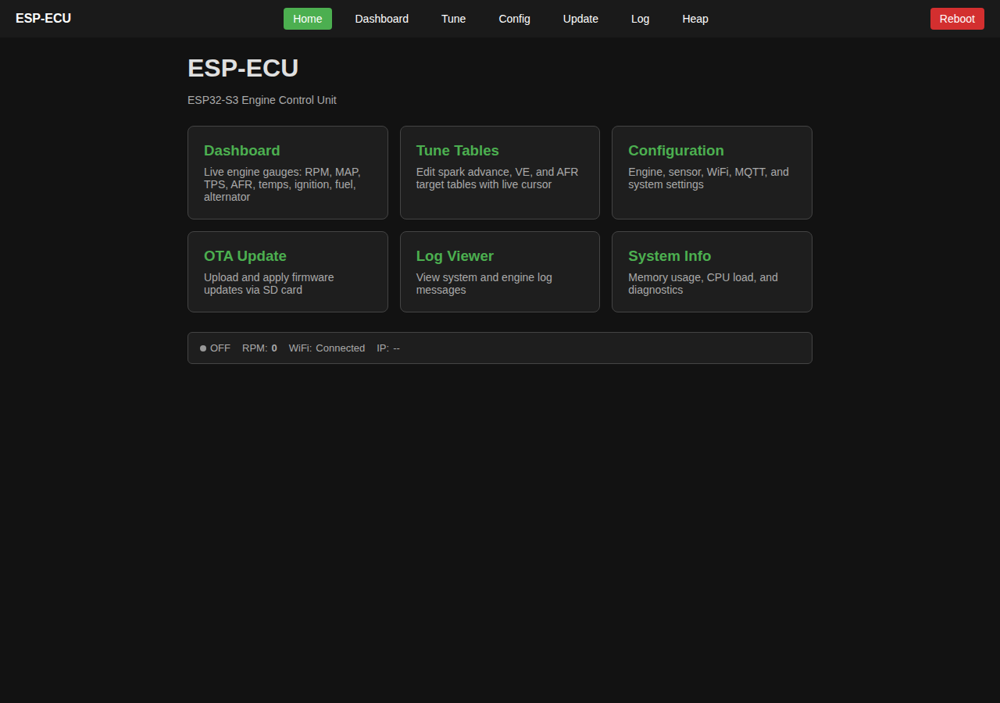
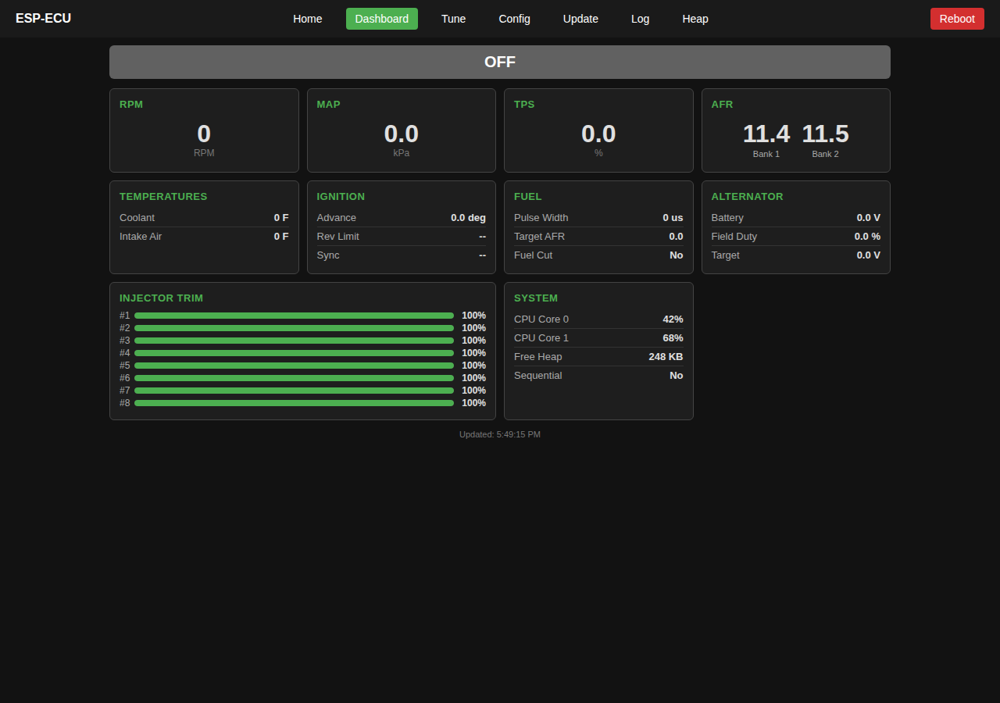
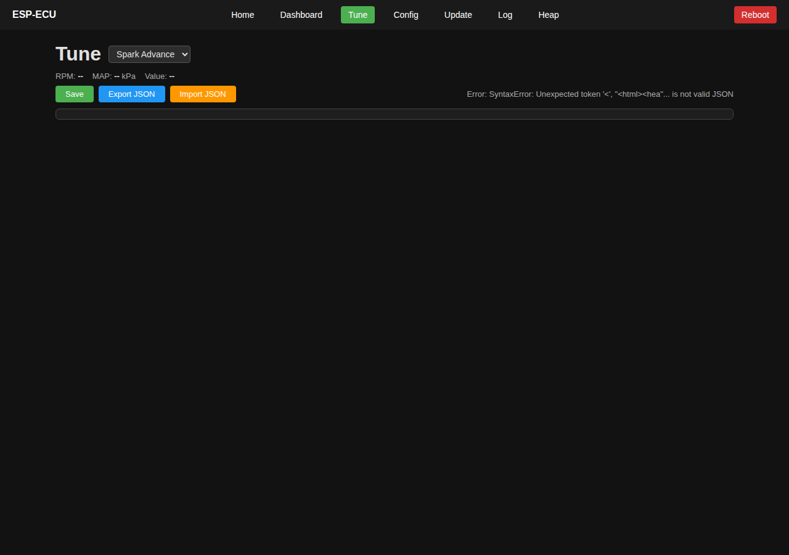
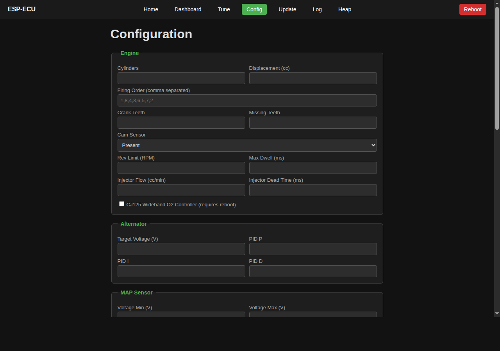
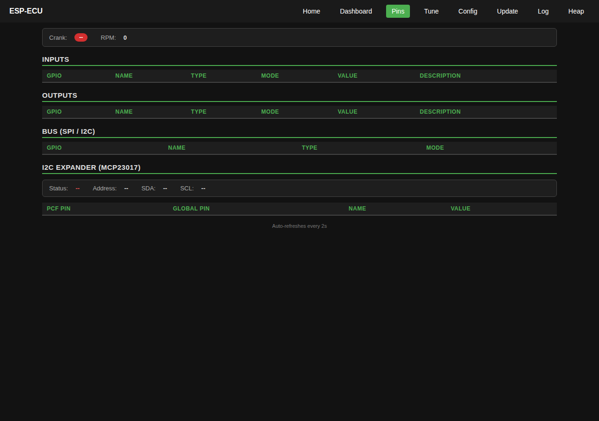
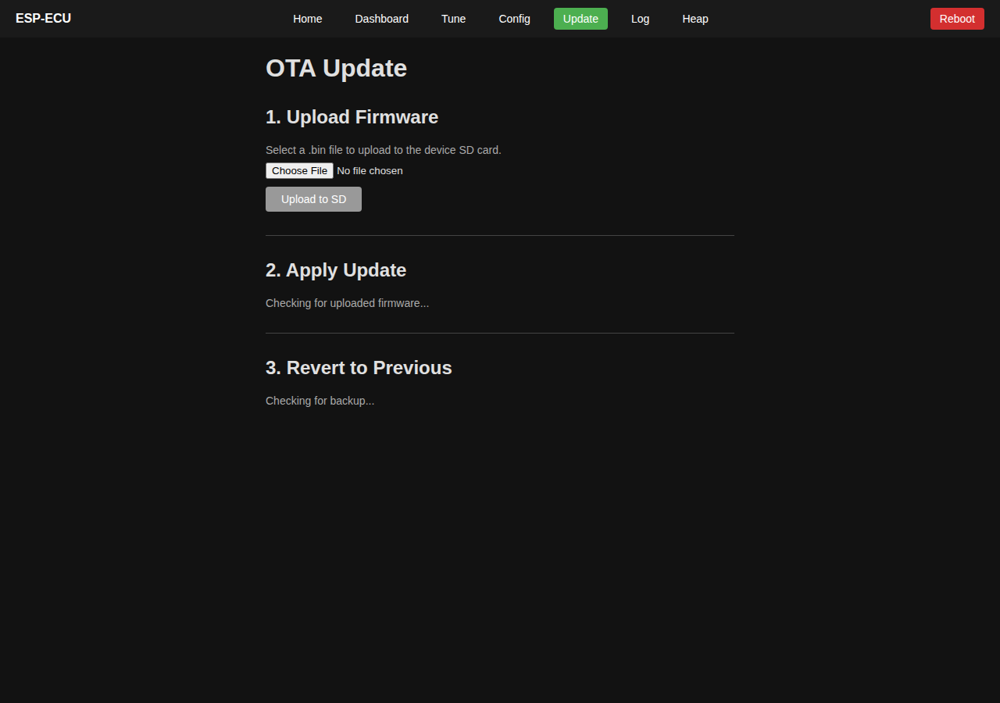
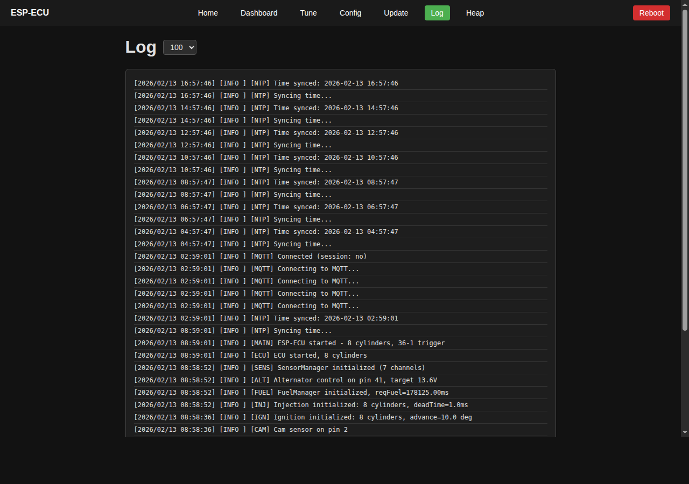
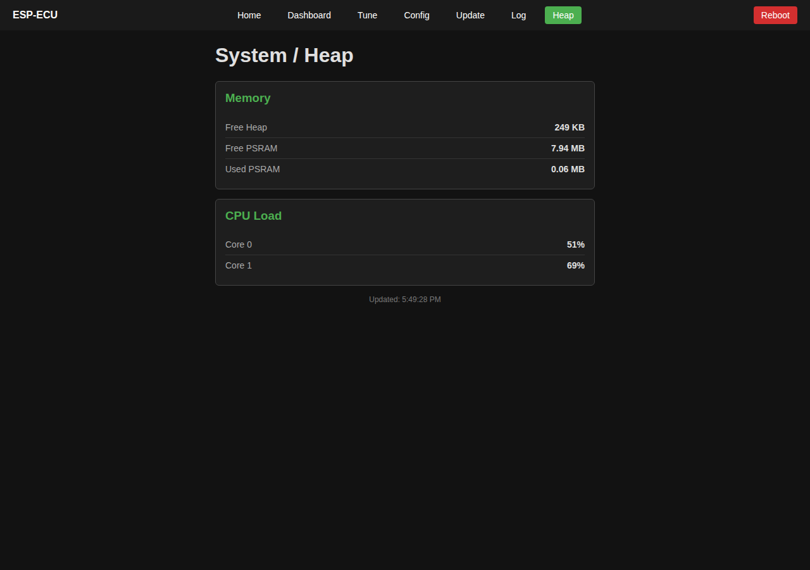
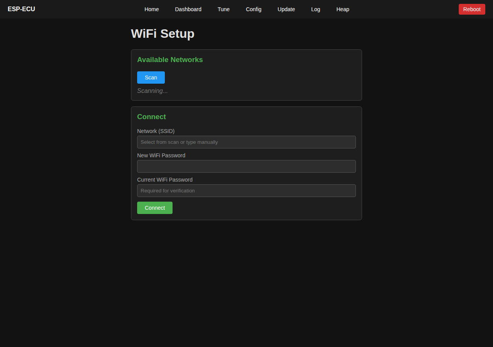

# ESP-ECU

ESP32-S3 Engine Control Unit for gas engines. Controls coil-over-plug ignition (up to 12 cylinders), sequential/batch fuel injection, dual-bank CJ125 wideband O2 closed-loop (LSU 4.9 sensors), and alternator field PWM. I/O expanded via MCP23017 I2C GPIO expander. Provides a REST API, WebSocket, and MQTT interface for remote monitoring and tuning.

## Features

- **Coil-over-plug ignition** -- Dwell + spark timing for up to 8 coils (GPIO10-17), expandable to 12 via MCP23017
- **Sequential fuel injection** -- Injector pulse width and timing for up to 8 injectors (3 native GPIO + 5 via MCP23017 I2C expander)
- **Dual-bank wideband O2** -- Bosch CJ125 SPI controller driving two LSU 4.9 wideband lambda sensors with PID heater control and 23-point piecewise-linear Ip-to-lambda lookup
- **Closed-loop AFR correction** -- O2-based fuel trim with configurable AFR targets per RPM/MAP cell
- **3D tune tables** -- 16x16 RPM x MAP interpolated lookup tables for spark advance, volumetric efficiency, and AFR targets. Editable via web UI
- **Alternator field control** -- PID-regulated PWM output for alternator voltage regulation
- **Crank/cam decoding** -- 36-1 trigger wheel with cam phase detection for sequential mode
- **Automatic transmission control** -- Ford 4R70W and 4R100 shift solenoid control, TCC PWM lockup, EPC line pressure, TFT temp monitoring, and MLPS gear range detection via second MCP23017 I2C expander (5V via PCA9306 level shifter). OSS/TSS speed sensors disabled (no free native GPIO)
- **Remote access** -- REST API, WebSocket, and MQTT for monitoring and tuning
- **Live dashboard** -- Real-time gauges and status at `/dashboard`
- **Web-based tuning** -- 16x16 table editor with live cursor at `/tune`
- **SD card configuration** -- WiFi, MQTT, engine, and tune table settings stored as JSON
- **Multi-output logging** -- Serial, MQTT, SD card with tar.gz compressed log rotation, and WebSocket streaming
- **OTA updates** -- Firmware upload via web interface
- **FTP server** -- File upload to SD card for web pages and config
- **PSRAM support** -- All heap allocations routed through PSRAM when available
- **WiFi AP fallback** -- Automatic AP mode for emergency recovery
- **Dual-core architecture** -- Real-time engine control on Core 1, application/networking on Core 0

## Architecture

### Dual-Core Split

**Core 1 -- Real-Time Engine Control** (dedicated FreeRTOS task via `xTaskCreatePinnedToCore`):
- Crank/cam ISR (hardware timer capture)
- RPM calculation
- Spark timing (dwell + fire)
- Injector timing (pulse width)
- No WiFi, no logging, no heap allocation on this core

**Core 0 -- Application** (Arduino loop + TaskScheduler):
- Sensor ADC reads (O2, MAP, TPS, CLT, IAT, battery voltage)
- Fuel/ignition table lookups and tuning calculations
- O2 closed-loop AFR correction
- CJ125 wideband heater state machine
- Alternator PID control
- Web server, MQTT, logging, config, OTA

Cores communicate via shared `EngineState` struct with volatile fields.

### Source Files

| File | Purpose |
|------|---------|
| `src/main.cpp` | Entry point, setup/loop, WiFi, tasks, core pinning |
| `src/ECU.cpp` | Top-level engine controller, EngineState management |
| `src/CrankSensor.cpp` | Crank trigger wheel decoding, RPM calculation |
| `src/CamSensor.cpp` | Cam phase detection for sequential mode |
| `src/IgnitionManager.cpp` | Coil dwell + spark timing |
| `src/InjectionManager.cpp` | Injector pulse width + timing |
| `src/FuelManager.cpp` | AFR targets, O2 correction, MAP load calc |
| `src/AlternatorControl.cpp` | PID field control for alternator |
| `src/TuneTable.cpp` | 2D/3D interpolated lookup tables |
| `src/SensorManager.cpp` | ADC reads: O2, MAP, TPS, CLT, IAT, VBAT |
| `src/CJ125Controller.cpp` | Dual-bank CJ125 wideband O2 controller (SPI + heater PID) |
| `src/ADS1115Reader.cpp` | ADS1115 I2C ADC wrapper for CJ125 Nernst cell temp |
| `src/TransmissionManager.cpp` | Ford 4R70W/4R100 automatic transmission controller |
| `src/PinExpander.cpp` | Multi-device MCP23017 I2C GPIO expander manager |
| `src/Config.cpp` | SD card and JSON configuration |
| `src/Logger.cpp` | Multi-output logging with tar.gz rotation |
| `src/WebHandler.cpp` | Web server and REST API |
| `src/MQTTHandler.cpp` | MQTT client with ECU topics |
| `src/PSRAMAllocator.cpp` | PSRAM allocator override |
| `src/OtaUtils.cpp` | OTA firmware update from SD card |

## Hardware

**Target board:** Freenove ESP32-S3-WROOM

### GPIO Pin Mapping

**Inputs:**

| Pin | GPIO | Description |
|-----|------|-------------|
| Crank | 1 | Digital interrupt, 36-1 trigger wheel |
| Cam | 2 | Digital interrupt, phase detection |
| CJ125_UA Bank 1 | 3 | ADC -- wideband O2 lambda/pump current |
| CJ125_UA Bank 2 | 4 | ADC -- wideband O2 lambda/pump current |
| MAP | 5 | ADC -- Manifold Absolute Pressure |
| TPS | 6 | ADC -- Throttle Position Sensor |
| CLT | 7 | ADC -- Coolant Temperature (NTC thermistor) |
| IAT | 8 | ADC -- Intake Air Temperature (NTC thermistor) |
| VBAT | 9 | ADC -- Battery voltage (47k/10k divider, 5.7:1) |
| OSS | -- | Output shaft speed (disabled -- no free GPIO) |
| TSS | -- | Turbine shaft speed (disabled -- no free GPIO) |

**Outputs:**

| Pin | GPIO | Description |
|-----|------|-------------|
| Coils 1-8 | 10-17 | COP ignition outputs |
| Injectors 1-3 | 18, 21, 40 | Native GPIO injector outputs |
| Injectors 4-8 | MCP23017 P3-P7 | I2C expander injector outputs |
| HEATER_OUT_1 | 19 | LEDC ch1 100Hz -- CJ125 heater bank 1 via BTS3134 |
| HEATER_OUT_2 | 20 | LEDC ch2 100Hz -- CJ125 heater bank 2 via BTS3134 |
| Alternator field | 41 | LEDC 25kHz PWM |
| TCC_PWM | 45 | LEDC ch4 200Hz -- Torque converter clutch (strapping pin, OK after boot) |
| EPC_PWM | 46 | LEDC ch6 5kHz -- Electronic pressure control (strapping pin, OK after boot) |
| Fuel pump relay | MCP23017 P0 | I2C expander |
| Tachometer output | MCP23017 P1 | I2C expander |
| Check engine light | MCP23017 P2 | I2C expander |
| SS_A | MCP23017 #1 P0 | Shift Solenoid A (5V via PCA9306) |
| SS_B | MCP23017 #1 P1 | Shift Solenoid B (5V via PCA9306) |
| SS_C | MCP23017 #1 P2 | Shift Solenoid C -- 4R100 only (5V via PCA9306) |
| SS_D | MCP23017 #1 P3 | Coast Clutch -- 4R100 only (5V via PCA9306) |

**SPI Bus (VSPI, shared SD + CJ125):**

| Pin | GPIO | Description |
|-----|------|-------------|
| CLK | 47 | SPI clock |
| MISO | 48 | SPI data in |
| MOSI | 38 | SPI data out |
| SD_CS | 39 | SD card chip select (SPI_MODE0 @ 50MHz) |
| SPI_SS_1 | MCP23017 P8 | CJ125 Bank 1 chip select (SPI_MODE1 @ 125kHz) |
| SPI_SS_2 | MCP23017 P9 | CJ125 Bank 2 chip select (SPI_MODE1 @ 125kHz) |

**I2C Bus (SDA=GPIO0, SCL=GPIO42):**

| Device | Address | Description |
|--------|---------|-------------|
| MCP23017 #0 | 0x20 | GPIO expander -- injectors 4-8, fuel pump, tach, CEL, SPI_SS_1/2 |
| MCP23017 #1 | 0x21 | GPIO expander -- shift solenoids SS-A/B/C/D (5V via PCA9306) |
| ADS1115 | 0x48 | 16-bit ADC -- CJ125_UR (CH0/1), TFT temp (CH2), MLPS (CH3) |

**GPIO Allocation Summary:**

All 23 usable native GPIOs (0-21, 38-48) are assigned. GPIO 22-25 do not exist on ESP32-S3. GPIO 26-32 are reserved for SPI flash. GPIO 33-37 are reserved for OPI PSRAM.

| Range | Assignment |
|-------|------------|
| 0 | I2C SDA |
| 1-2 | Crank + Cam ISR inputs |
| 3-4 | CJ125 wideband O2 ADC |
| 5-9 | Sensor ADC (MAP, TPS, CLT, IAT, VBAT) |
| 10-17 | Coil outputs (COP ignition) |
| 18, 21, 40 | Injector outputs (native GPIO) |
| 19-20 | CJ125 heater PWM |
| 38-39 | SD card SPI (MOSI, CS) |
| 41 | Alternator field PWM |
| 42 | I2C SCL |
| 43-44 | UART TX/RX (Serial) |
| 45-46 | TCC/EPC PWM (strapping pins, OK after boot) |
| 47-48 | SD card SPI (CLK, MISO) |

## CJ125 Wideband O2 Controller

Dual-bank Bosch CJ125 SPI controller driving two LSU 4.9 wideband lambda sensors. Disabled by default (`cj125Enabled = false` in config). When disabled, SensorManager falls back to linear 0-5V to AFR 10-20 mapping from GPIO3/4.

**Heater state machine** (non-blocking, per bank):

```
IDLE -> WAIT_POWER (battery > 11V) -> CALIBRATING -> CONDENSATION (2V, 5s)
    -> RAMP_UP (8.5V -> 13V at +0.4V/s) -> PID (heater regulation, readings valid)
    -> ERROR (diagnostic failure)
```

- SPI protocol: 16-bit frames at 125kHz SPI_MODE1, chip select via MCP23017
- PID heater control: P=120, I=0.8, D=10, integral clamped +/-250
- Lambda lookup: 23-point piecewise-linear interpolation from Bosch LSU 4.9 Ip characteristic curve
- Decimation: `update()` called every 10ms from ECU, CJ125 logic executes every 100ms

The CJ125 SPI register constants and PID tuning values are derived from the [Lambda Shield](https://github.com/Bylund/Lambda-Shield-Example) project by Bylund.

## Screenshots

| | |
|---|---|
|  |  |
| Home | Dashboard |
|  |  |
| Tune Tables | Configuration |
|  |  |
| Pin Map | OTA Update |
|  |  |
| Log Viewer | System / Heap |
|  | |
| WiFi Setup | |

## Web Pages

All pages served from SD card `/www/` directory.

| Page | Purpose |
|------|---------|
| `/` | Landing page with nav cards |
| `/dashboard` | Live ECU gauges and status |
| `/tune` | 16x16 table editor with live cursor |
| `/pins` | GPIO pin map with live state |
| `/config` | WiFi/MQTT/engine/alternator/sensor settings |
| `/update` | OTA firmware upload |
| `/log/view` | Log viewer |
| `/heap/view` | Memory/CPU monitor |
| `/wifi/view` | WiFi scan and test |
| `/admin/setup` | Initial password setup |

## Getting Started

### Prerequisites

- [PlatformIO](https://platformio.org/) (CLI or IDE extension)
- USB cable connected to ESP32-S3 board

### Secrets Setup

Create `secrets.ini` in the project root (gitignored):

```ini
[secrets]
build_flags =
	-D AP_PASSWORD=\"your-ap-password\"
	-D XOR_KEY=\"your-random-base64-key\"
```

### Build and Upload

```bash
# Build
pio run -e freenove_esp32_s3_wroom

# Upload firmware
pio run -t upload -e freenove_esp32_s3_wroom

# Serial monitor
pio run -t monitor -e freenove_esp32_s3_wroom
```

## Dependencies

Managed automatically by PlatformIO (`lib_deps` in `platformio.ini`).

| Library | Author | Purpose |
|---------|--------|---------|
| [TaskScheduler](https://github.com/arkhipenko/TaskScheduler) | Anatoli Arkhipenko | Cooperative multitasking on Core 0 |
| [ESPAsyncWebServer](https://github.com/ESP32Async/ESPAsyncWebServer) | ESP32Async | Async HTTP and WebSocket server |
| [AsyncTCP](https://github.com/ESP32Async/AsyncTCP) | ESP32Async | TCP transport for async web server |
| [AsyncMqttClient](https://github.com/marvinroger/async-mqtt-client) | Marvin Roger | MQTT client with auto-reconnect |
| [ArduinoJson](https://github.com/bblanchon/ArduinoJson) | Benoit Blanchon | JSON parsing and serialization |
| [CircularBuffer](https://github.com/rlogiacco/CircularBuffer) | Roberto Lo Giacco | Lock-free circular buffer for ISR queues |
| [ESP32-targz](https://github.com/tobozo/ESP32-targz) | tobozo | tar.gz compression for log rotation |
| [SimpleFTPServer](https://github.com/xreef/SimpleFTPServer) | Renzo Mischianti | FTP server for SD card file uploads |
| [Adafruit MCP23017](https://github.com/adafruit/Adafruit-MCP23017-Arduino-Library) | Adafruit | I2C GPIO expander driver |
| [Adafruit ADS1X15](https://github.com/adafruit/Adafruit_ADS1X15) | Adafruit | 16-bit I2C ADC for CJ125 Nernst cell temp |
| [StringStream](https://github.com/0xtj/StringStream) | 0xtj | String-based stream wrapper |

## Acknowledgments

This project builds on the work of many open-source projects and their authors. Thank you to everyone who made their code freely available.

### CJ125 Wideband O2

- **[Lambda Shield](https://github.com/Bylund/Lambda-Shield-Example)** by [Bylund](https://github.com/Bylund) -- The CJ125 SPI register constants, PID tuning values, and heater control state machine are derived from this project. Lambda Shield provided the foundational reference for interfacing with the Bosch CJ125 wideband controller chip
- **Bosch CJ125 and LSU 4.9 datasheets** -- The Ip-to-lambda characteristic curve lookup table is derived from the official Bosch LSU 4.9 sensor datasheet

### Core Libraries

- **[TaskScheduler](https://github.com/arkhipenko/TaskScheduler)** by [Anatoli Arkhipenko](https://github.com/arkhipenko) -- Cooperative multitasking framework that manages all periodic tasks on Core 0
- **[ArduinoJson](https://github.com/bblanchon/ArduinoJson)** by [Benoit Blanchon](https://github.com/bblanchon) -- JSON engine used for all configuration, API responses, and MQTT payloads
- **[ESPAsyncWebServer](https://github.com/ESP32Async/ESPAsyncWebServer)** and **[AsyncTCP](https://github.com/ESP32Async/AsyncTCP)** by [ESP32Async](https://github.com/ESP32Async) -- Non-blocking web server and WebSocket support
- **[AsyncMqttClient](https://github.com/marvinroger/async-mqtt-client)** by [Marvin Roger](https://github.com/marvinroger) -- MQTT client for telemetry publishing

### Hardware Drivers

- **[Adafruit MCP23017](https://github.com/adafruit/Adafruit-MCP23017-Arduino-Library)** and **[Adafruit ADS1X15](https://github.com/adafruit/Adafruit_ADS1X15)** by [Adafruit](https://github.com/adafruit) -- I2C GPIO expander and 16-bit ADC drivers. Adafruit's open-source hardware libraries and documentation are invaluable for embedded projects
- **[CircularBuffer](https://github.com/rlogiacco/CircularBuffer)** by [Roberto Lo Giacco](https://github.com/rlogiacco) -- ISR-safe circular buffer used for interrupt-driven input queues

### Infrastructure

- **[ESP32-targz](https://github.com/tobozo/ESP32-targz)** by [tobozo](https://github.com/tobozo) -- tar.gz compression for log file rotation on SD card
- **[SimpleFTPServer](https://github.com/xreef/SimpleFTPServer)** by [Renzo Mischianti](https://github.com/xreef) -- FTP server for uploading web pages and config to the SD card
- **[Arduino-ESP32](https://github.com/espressif/arduino-esp32)** by [Espressif](https://github.com/espressif) -- The Arduino framework for ESP32 that makes all of this possible
- **[PlatformIO](https://platformio.org/)** -- Build system and dependency management

## License

This project is provided as-is for educational and personal use.
